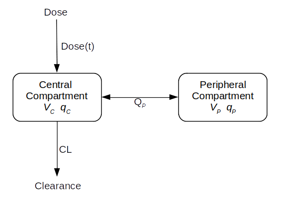

# SABS-Pharmokinetics-Project

[](https://github.com/SABS-best-team/SABS-Pharmokinetics-Project/actions/workflows/ci-unittests.yml)
[](https://codecov.io/gh/SABS-best-team/SABS-Pharmokinetics-Project)
[](https://sabs-pharmokinetics-project.readthedocs.io/en/latest/?badge=latest)

`SABS-Pharmokinetics-Project` provides a user-friendly interface for anyone to explore the behaviour of a basic pharmokinetics model.


Contents
========

 * [Why?](#why)
 * [Installation](#installation)
 * [Usage](#usage)
 * [Model Details](#model-details)
 * [Output Structure](#output-structure)
 * [Authors](#authors)
 * [License](#license)

## Why?
Pharmokinetic (PK) modelling tracks the levels of substances through an organism, such as in the context of drug delivery. Understanding the pharmokinetics of a drug influences its dosing, benefits and delivery strategy, and plays a key role in clinical decision making. This tool aims to provide an intuituve model to engage stakeholders (including practitioners and patients) in basic pharmokinetic principles.

## Installation
This module can either be installed by cloning the git repository, or via pip install. Either method will first require python to be installed on your local machine - to check whether python is installed on your machine, run the following command in your terminal (or Powershell for windows):

```bash
python --version
```

If you don’t have a version of Python on your system, then this will launch the Microsoft Store and redirect you to the [Python application page](https://www.microsoft.com/en-us/p/python-39/9p7qfqmjrfp70) on Windows. You can also download the latest version of python on all operating systems (or update it if your version number output above is less than 3.6) from the [official installer](https://www.python.org/downloads/). Further instructions are provided by [Real Python](https://realpython.com/installing-python/).

This project may then simply by installed in your terminal (or Powershell for windows) using a package called 'pip' that is installed with python be default. Enter the command:

```bash
pip install pk-model
```

All dependancies for this project are listed in `requirements.txt`. This may simply be bulk installed via the command line, using the command:

```bash
pip install -r requirements.txt
```
## Usage

We have developed a user-friendly `pkmodel/api.py` file for new users to run these simulations. 
 1. Create a dose function (either use the default or extensive usage examples are provided in the documentation).
 2. Chose whether to run the IV or Sub model (see descriptions in [Model Details](#model-details)), and find the appropriate function (`solve_iv_toFile` or `solve_sub_toFile)`.
 3. Change parameters in function call to desired values (all parameters have default values assigned, and an explanation below the function).

 Please note that further usage examples, and complete documentation is avaliable at ---readthedocslink---

For example:

```python
mydoseFn = pk.create_periodic_dosing(1,4,5)
pk.solve_subcut_toFile('data.csv', doseFn = mydoseFn, tSpan = 25)
pk.PlotfromCSV('data.csv').plot('png')
```
This script generates the following figure:

-- insert figure --

## Model Details
Pharmacokinetics provides a quantitative description for the delivery of a drug to a patient, the diffusion of that drug through the plasma/body tissue, and the subsequent clearance of the drug from the patient’s system. 

Our model replicates each of the three behaviours above with a separate compartment, each labelled with an associated suffix (x):

 * Entrance (_e_): This compartment (volume _V<sub>e</sub>_) represents initial storage of the administered drug, from which it is absorbed at rate _k<sub>a</sub>_.
 * Centre (_c_): The central compartment (volume _V<sub>c</sub>_) links all other compartments, and is responsible for absorbtion and excretion/clearance (at rate _CL_) of the drug.
 * Periphery (_p_): This compartment (volume _V<sub>p</sub>_) allows redistribution of the drug from the central compartment, at rate _Q<sub>pc</sub>_.

Each body is assumed to be kinetically homogeneous. All volumes _V_ are measured in ml, all transition rates _Q_ in ml/h, and all drug concentrations (denoted by _q<sub>x</sub>_ for compartment _x_) in ng.

### Subcutaneous (Sub) Model
This is expressed within the 'sub' model for a subcutaneous dosing control (for slow drug absorbtion, i.e. through skin tissue), which is represented by the entrance compartment. For interested users, this may be represented by the following system of equations:

  <br /> 


  <br /> 


where the variables are defined as:

 * `V_c`: _[mL]_ - the volume of the central compartment
 * `V_p`: _[mL]_ - the volume of the peripheral compartment

 * `Q_p`: _[mL/h]_ - the transition rate between central compartment and peripheral compartment
 * `CL:` _[mL/h]_ - the clearance/elimination rate from the central compartment
 * `k_a`: _[/h]_ - the “absorption” rate from the entrance compartment for the subcutaneous dosing 

 * `q_c0`: _[ng]_ - the initial drug quantity in the central compartment
 * `q_p0`: _[ng]_ - the initial drug quantity in the periphery compartment
 * `q_e0`: _[ng]_ - the initial drug quantity in the entrance compartment

 ### Intravenous Bolus (IV) Model
 An alternative dosing protocol we represent here is the Intravenous Bolus (IV), where direct injection allows much faster drug delivery. This negates the role of the entrance component, and so the dose is delivered directly to the central compartment. This may be represented by the simpler set of equations, where all terms are defined as above,

  <br /> 


These equations can be expressed diagramatically:



## Output Structure
The analysis code outputs a labelled `.csv` file, with the time, dose function and drug quantity for each compartment. Users can conduct independant analysis on these files, however we have also implemented basic analysis methods that take these data files and plot the drug quantities in each compartment over time.
## Authors
Elizabeth Hayman, Kit Gallagher, Luke Heirene, Nicholas Fan, Patricia Lamirande

## License
[MIT](https://choosealicense.com/licenses/mit/)
